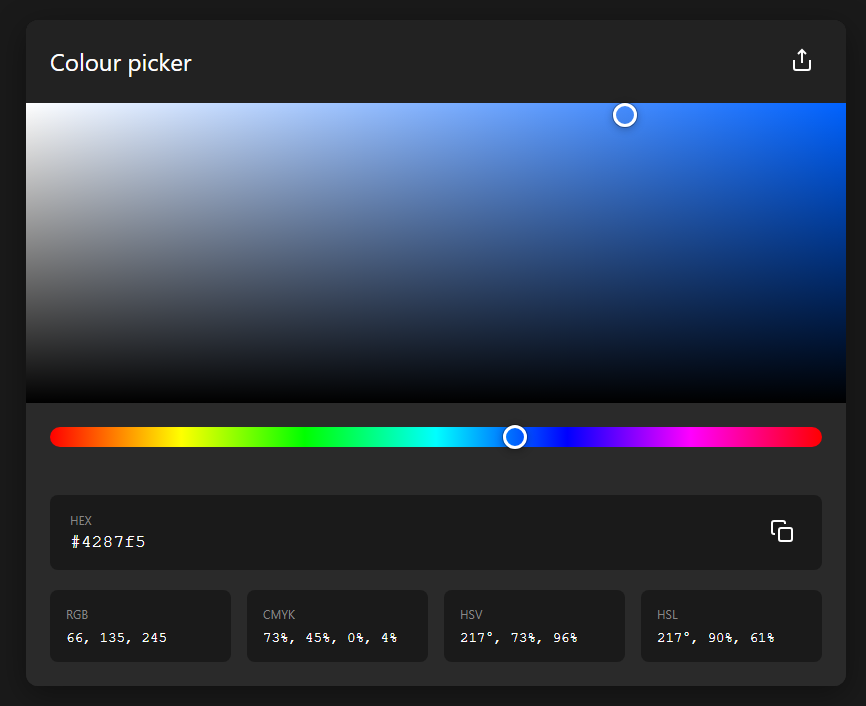

<center>

# __Toolkit-and-Snippets__

```
vscode://file/D:/Workbench/Projects/Coding/Toolkit-and-Snippets
```
</center>

## Color Picker
[Live](https://abrarrajin.github.io/Toolkit-and-Snippets/color-picker/color-picker.html) [/ md file](/color-picker/color-picker.md)

This is a simple color picker with Hex values.

 

---
## Github Tutorials
github FAQ on setup via VSCODE [md file](/github-all/github-tutorials.md)  

---
## Python Basics Cheatsheet
Quick look at all basic python codes. [Quickref](https://quickref.me/python)
